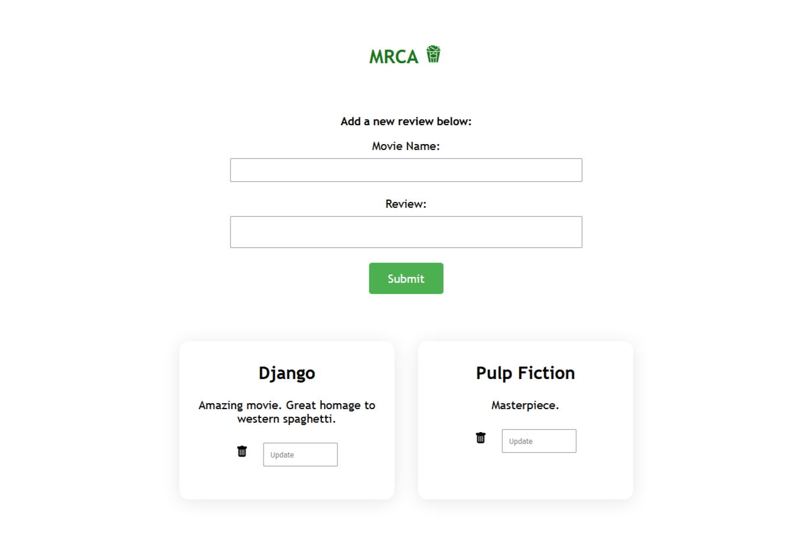

# Movie Review Crud Application
 My first Full Stack CRUD application using React, Node, Express, Axios and SQL (MySQL):
 
 It's a basic page where you can create, read, update and delete movie reviews.
 
 
 
 ### Installation

1. Clone repo

2. Change to directory

````
cd mrca-crud
cd client
````   

3. Install dependencies and start front-end

````
npm install
npm start
````

4. Change directory to server

```
cd ..
cd server
```

5. Install dependencies and start back-end

````
npm install
npm start
````

OBS: The MySQL database needs to be with:
  host: "localhost",
  user: "root",
  password: "system",
  database: "cruddb".
  
Credits: development based on this [tutorial series](https://www.youtube.com/watch?v=T8mqZZ0r-RA). 
